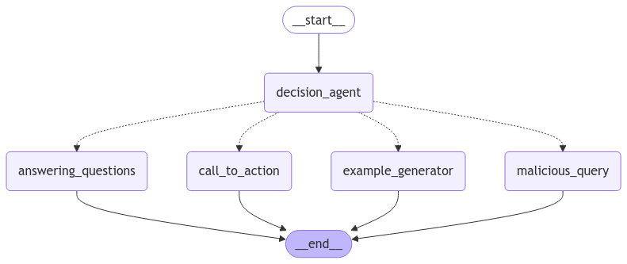

# Coxcox AI WhatsApp Agent 🤖

An AI-powered telemarketing agent for WhatsApp, automating customer support, order management, and lead generation using AWS serverless infrastructure.

---

## Description

This project provides an AI agent that handles customer interactions on WhatsApp, leveraging AWS Lambda, SQS, S3, and Amazon Bedrock. It processes incoming messages, classifies them into specific use cases, and generates context-aware responses. Key features include:

- **WhatsApp Integration**: Processes incoming messages via webhooks.
- **Multi-Stage Workflow**: Uses LangGraph to route queries to specialized agents.
- **State Management**: Persists conversation states in S3 for continuity.
- **Serverless Architecture**: Built on AWS Lambda, SQS, and S3 for scalability.

**Technologies**: Python, AWS Lambda, SQS, S3, Amazon Bedrock, LangChain, LangGraph.

---

## Architecture Overview

WhatsApp → Verification Handler (Lambda) → Event Handler (Lambda) → SQS  
↑ ↓  
Webhook Verification Message Processing  
↓  
Orchestrator (LangGraph)  
↓  
Response Generation → Database/Email

---

## Installation & Deployment

### Prerequisites

- AWS account with permissions for Lambda, SQS, S3, and Bedrock.
- WhatsApp Business API access.
- Python 3.9+ and `pip`.

## Usage

### Webhook Setup

- Configure WhatsApp Business API to point to the verification_handler Lambda URL.
- Use the VERIFY_TOKEN during setup to validate the webhook.

### Message Flow

1. **Incoming Message**: WhatsApp sends a payload to the event_handler Lambda.
2. **Processing**:
   - Messages are validated, timestamps converted, and data extracted.
   - Valid messages are sent to SQS for async processing.
3. **Orchestration**:
   - The orchestrator.py LangGraph classifies messages into:
     - Use Case 1: General queries about services.
     - Use Case 2: Example generation.
     - Use Case 3: Contact requests.
     - Malicious Query: Blocked.
4. **Responses** are generated using Amazon Bedrock models.

### Environment Variables

| Variable             | Description                                 |
| -------------------- | ------------------------------------------- |
| `QUEUE_URL`          | SQS queue URL for message processing.       |
| `VERIFY_TOKEN`       | Token for WhatsApp webhook verification.    |
| `AWS_S3_BUCKET_NAME` | S3 bucket for LangGraph checkpoint storage. |

---

## Features

- **Automated Classification**: Routes messages to specialized agents.
- **Stateful Conversations**: Saves chat history in S3.
- **Security**: Validates webhook origins and blocks malicious queries.
- **Scalability**: Serverless design handles variable workloads.

## Limitations

- Currently supports WhatsApp only; relies on Bedrock model availability.

---

## Contributing

1. Fork the repository.
2. Create a feature branch: `git checkout -b feat/your-feature`.
3. Follow Python PEP8 guidelines and include tests.
4. Submit a pull request with a detailed description.

See `CONTRIBUTING.md` for full guidelines.

---

## Credits

- **Author**: Alberto Meza
- **Libraries**: LangChain, LangGraph, Boto3, Amazon Bedrock.

---

## Contact

For questions or support, contact albertog1meza@gmail.com.
